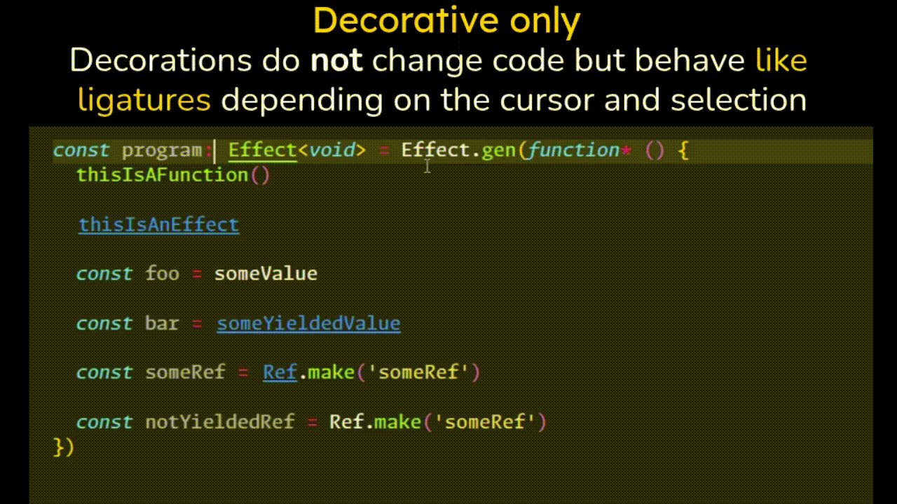
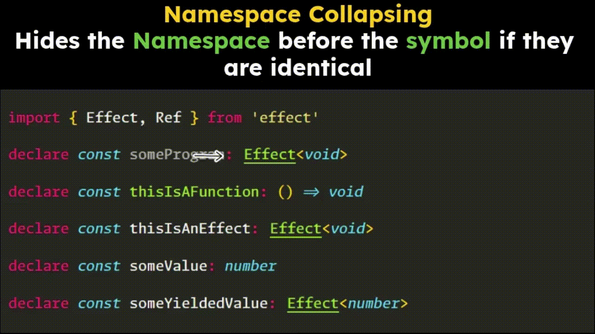
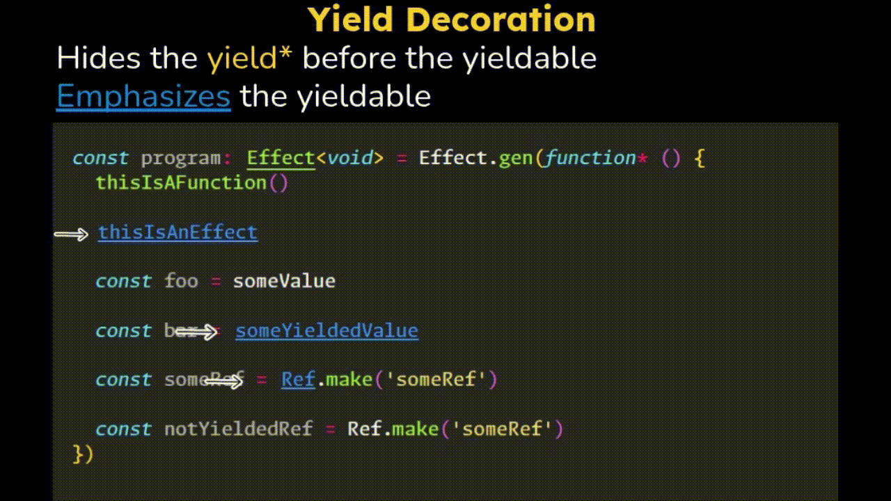

# effect-decorate

`effect-decorate` is an extension aiming at improving the quality of life of developers authoring effect-ts code.

It does so by providing a series of [text decorations](https://code.visualstudio.com/api/references/vscode-api#TextEditorDecorationType) that enhance the readability of code.

## Get in touch!

This project is still in its infancy! If you have any suggestions, feedback (including very negative one, it's welcome) or just want to share your pain points or quality-of-life improvements you'd like when authoring effect code please open a PR and we'll try to find a solution or implementation.

## Features

### Decorative only - does not change the code

The decorations do not change the underlying text in the editor, they only apply to the code that is _not_ currently selected (there is no cursor or selection at the position of the decoration).

### Namespace collapsing

Given common effect-ts patterns such as `Effect.Effect`, `Schema.Schema`, `Layer.Layer` hides the `Namespace.` part.

### yield\* decoration

Improves the readability of `yield* Foo` by hiding the `yield*` part and emphasizing the yieldable one. Very quickly associate effects with emphasized styling.

### Customizable

The decorations can be enabled/disabled one by one in the panel settings. Use only what you want!

## Roadmap

Note: the roadmap is WIP and up to debate.

- Effect LSP integration:
  - effects coloring depending on the error channel. Instantly recognize effects that can fail from those who can't just by their color.
  - see metrics, logs and spans directly in your text editor (similar to Quokka)
- Splitting type declarations from implementations (similar to Haskell) for improved readability.
- Hover decoration: 

## Credits

This extension is built around ideas and implementations from Effect's own [VSCode Extension](https://github.com/Effect-TS/vscode-extension).

Huge thanks to [Tim Smart](https://github.com/tim-smart) and [Mattia Manzati](https://github.com/mattiamanzati) for their excellent work and the Effect community for the MIT license.

## Release Notes

### 0.0.1

First release.

### 0.2.0

- Add customizeable settings panel.
- Merge yield and yieldable setting in one. It does not make sense to hide the `yield*` part without emphasizing the yieldable.
- Improve documentation with images.
